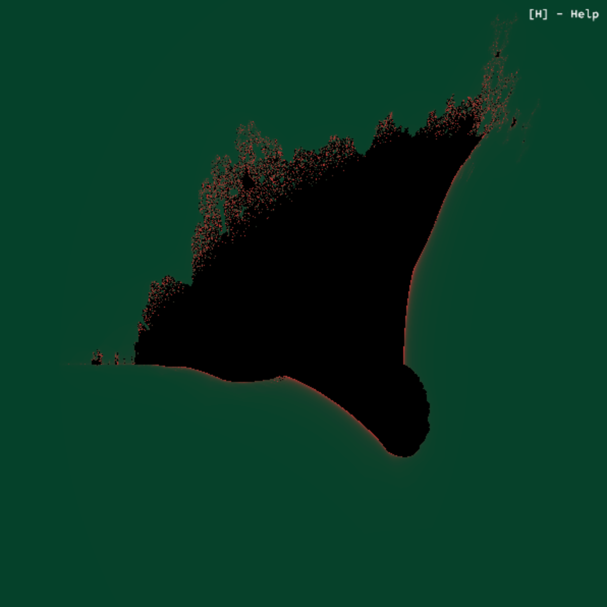
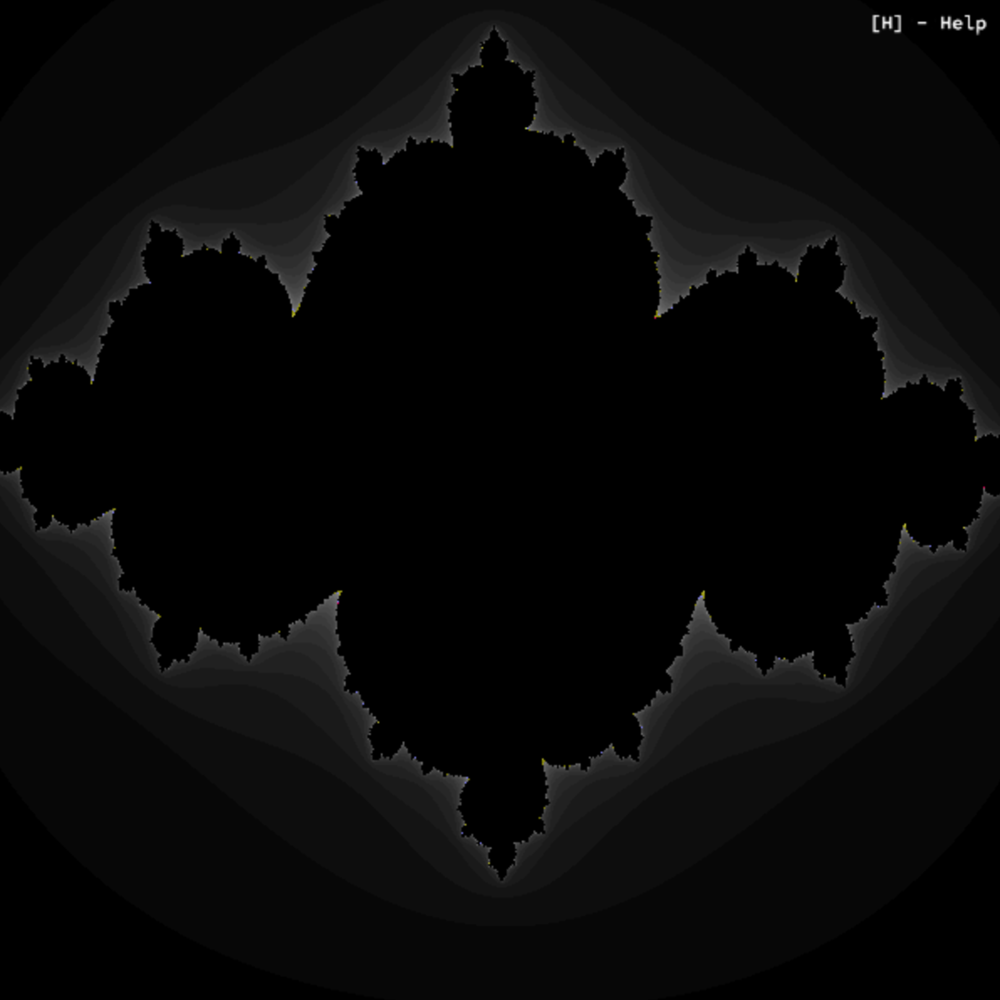
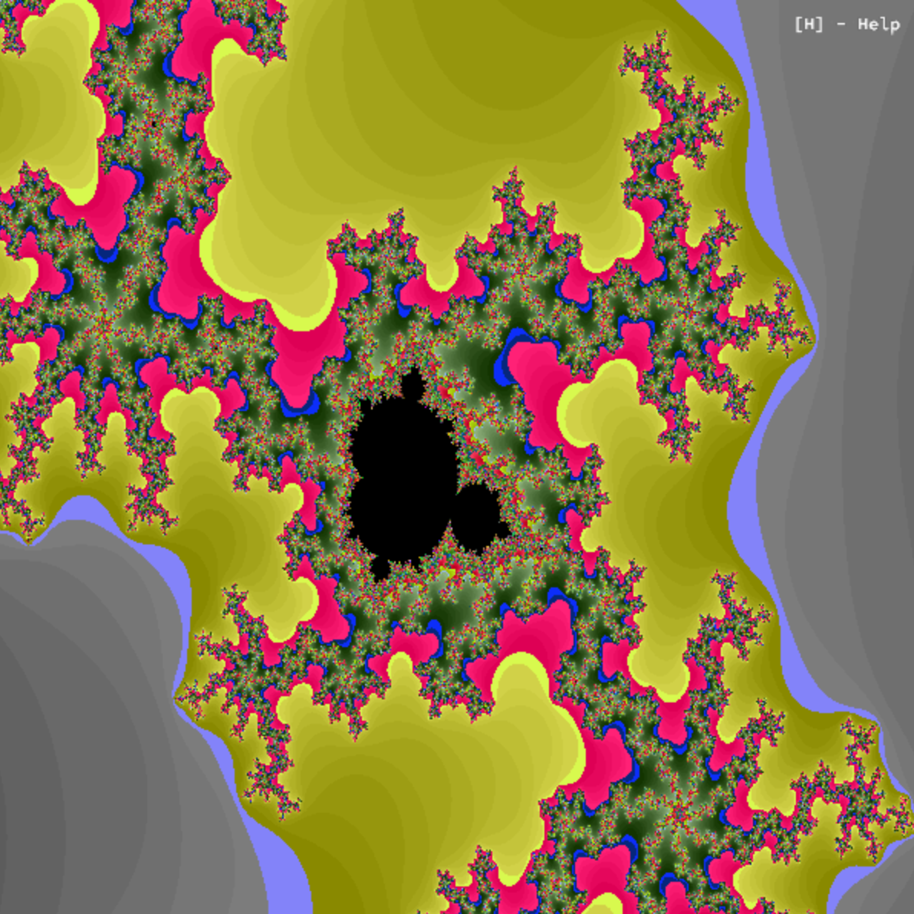
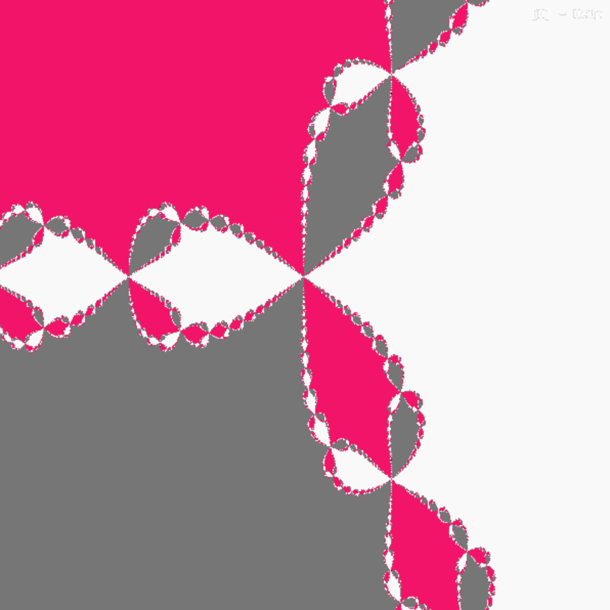
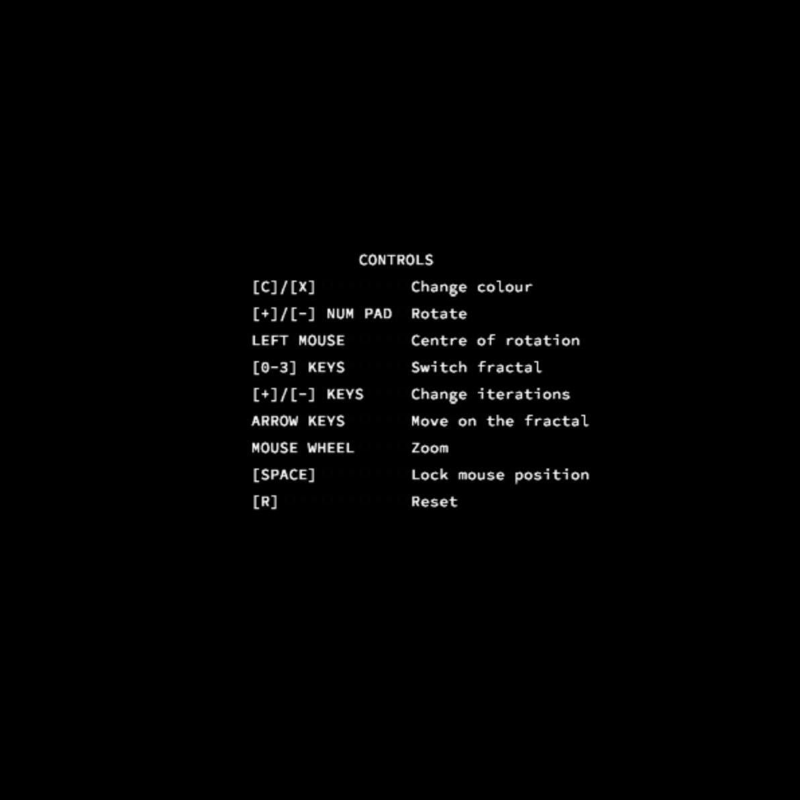

# Fractol

 

  

## Table of Contents
- [Project Description](#project-description)
- [Project Requirements](#project-requirements)
- [Getting Started](#getting-started)
  - [Prerequisites](#prerequisites)
  - [Installation](#installation)
- [Usage](#usage)
- [Features](#features)


## Project Description

This project invites to explore the fascinating world of fractals and computer graphics. The task is to create an interactive graphical program that allows users to explore various fractal sets, providing an opportunity to delve into mathematical beauty and computer graphics.
Fractol is designed to kick-off your skill development in graphical programming, handling user input, and creating real-time interactive graphics.

## Project Requirements

- Display various types of fractals, such as the Mandelbrot and Julia sets.
- Allow users to zoom in and out of fractal images.
- Provide real-time interaction and navigation with the fractal images.
- Implement color palettes and visual effects to enhance the graphics.

## Getting Started

Follow these instructions to get started with the Fractol project.

### Prerequisites

Before you begin, make sure you have the following prerequisites:

- A Linux-based system (the project is designed for Unix-like environments).
- GNU make
- GCC compiler

### Installation

1. Clone this repository to your local machine:

   ```sh
   git clone https://github.com/yourusername/42-fractol.git
   ```
   
2. Compile the project
   
   ```sh
    make
   ```

### Usage

To run Fractol, execute the program with the following command:

    ```sh
    ./fractol [fractal_set]
    ```

Where [fractal_set] is the name of the fractal you want to explore (e.g., "mandelbrot" or "julia").

Use the mouse and keyboard controls to navigate, zoom, and interact with the fractal in real-time. Refer to the in-app instructions for control details.

### Features

Fractol offers several features, including:

    Real-time zooming and navigation in fractal sets until computational limits are reached.
  <video src="assets/videos/burningship_zoom.mov" width=180/>
  <video src="assets/videos/julia_mouse_move.mov" width=180/> 
    Multiple fractal sets, including the Mandelbrot and Julia sets (bonus: Newton fractal and Burning Ship fractal).
    Customizable color palettes for stunning visual effects.
  <video src="assets/videos/mandelbrot_colour.mov" width=180/>
    Interactive controls for zooming, panning, and exploring the fractals.
  <video src="assets/videos/mandelbrot_detail.mov" width=180/">
    Rotation of the fractal around an arbitrary point

Explore the features and unleash your creativity in the world of fractals.
